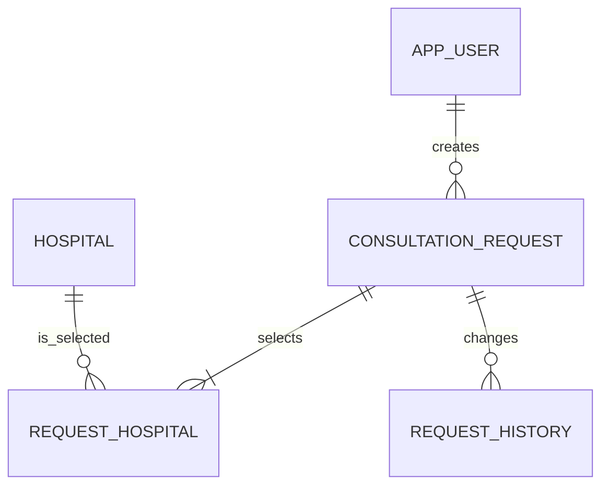

# 상담 요청 도메인 모델

이 문서는 과제의 **논리 모델과 정책**입니다. 제공된 병원 마스터를 제외한 물리 테이블명, 컬럼, 인덱스, 제약 조건, 구현 방식은 지원자가 설계합니다.



## 제공되는 데이터

| 논리 엔터티 | 물리 테이블 | 용도 |
| --- | --- | --- |
| 사용자 | `app_user` | 과제용 사용자 2명. 기본 사용자 ID는 `00000000-0000-0000-0000-000000000001`입니다. |
| 병원 | `hospital` | 읽기 전용 병원 마스터 30개. 앱 카드용 16:9 이미지 URL을 포함합니다. |
| 병원 카테고리 | `hospital_category`, `hospital_category_mapping` | 실제 프로젝트의 성형 depth-2 부위 카테고리(눈, 코, 얼굴지방성형, 바디지방성형, 안면윤곽/양악, 가슴, 거상성형)와 병원 관계입니다. |

## 지원자가 설계할 논리 엔터티

| 엔터티 | 반드시 보장할 사항 |
| --- | --- |
| 상담 요청 | 작성자, 상담 내용, 현재 상태, 생성·수정 시각을 보존합니다. |
| 요청 선택 병원 | 하나의 상담 요청은 1~3개 병원을 선택합니다. 중복 선택을 허용하지 않습니다. |
| 상태 변경 이력 | 상태 변경 전후, 변경 시각, 변경 사유를 추적할 수 있어야 합니다. |
| 중복 제출 방지 | 앱의 재시도 또는 중복 탭으로 같은 제출이 여러 번 처리되지 않아야 합니다. 구현 방식은 자유입니다. |

## 상태 전이 정책

```text
DRAFT ──submit──> SUBMITTED ──cancel──> CANCELLED
```

- 새 상담 요청은 `DRAFT`에서 시작합니다.
- `DRAFT`에서만 내용을 수정할 수 있습니다.
- 제출 시 선택 병원이 1~3개여야 하며, 상담 내용은 비어 있을 수 없습니다.
- `SUBMITTED`와 `CANCELLED` 요청은 수정할 수 없습니다.
- `CANCELLED`는 최종 상태입니다. 재제출이 필요하면 새 초안을 생성해야 합니다.
- 상태가 바뀔 때마다 이력을 남겨야 합니다.

## 의도적으로 열어 둔 설계 판단

- 중복 제출 방지를 유니크 제약, idempotency key, 비관/낙관 락, 요청 fingerprint 중 어떤 방식으로 구현할지
- 상태 이력을 별도 테이블, 이벤트, 또는 다른 구조로 유지할지
- 목록 조회를 위한 인덱스와 페이지네이션 방식
- 도메인 상태 전이 규칙을 Entity, Service, 또는 별도 도메인 객체 중 어디에 둘지

선택한 방식과 대안, 채택 이유를 제출 README에 기록하세요.
